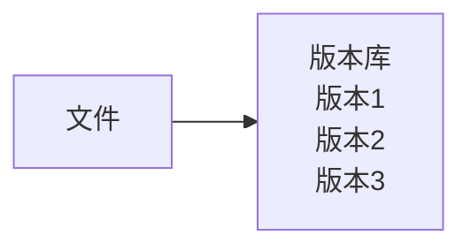
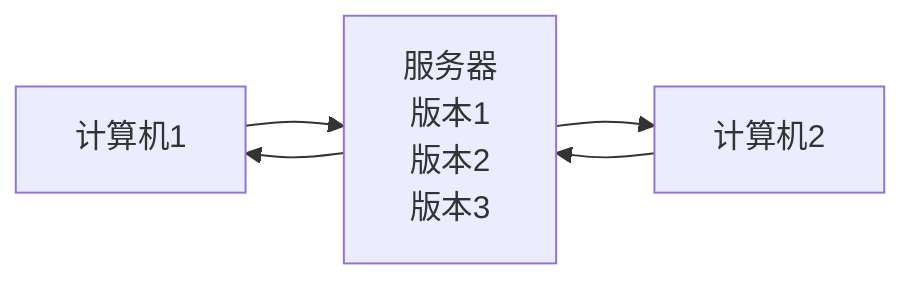
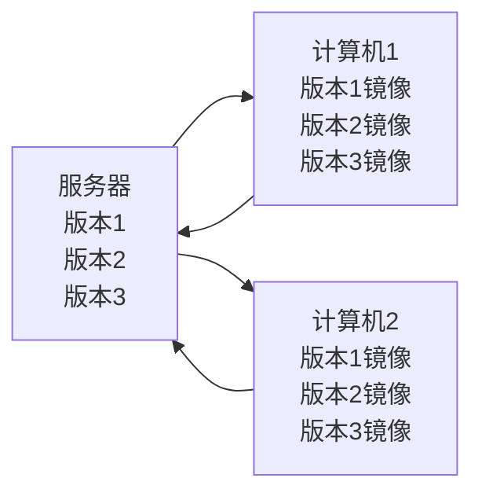

# Git基础简介

## 版本控制（Version Control System）

**定义：版本控制是一种系统，记录一个或若干文件内容变化，以便将来查阅特定版本修订情况的系统。**

### 本地控制系统

使用数据库+patch set的方式保留文件之间的差异。通过叠加补丁来恢复文件。

### 集中式版本控制系统

本地系统解决了，那么多系统协作呢？
将文件的所有修订版本放在单一服务器上，每个用户都可以从中心服务器上获取最新版本的文件，然后在本地进行修改。
但它的问题在于，一旦服务器宕机，那么所有的用户都无法进行修改。
除了本地的快照，历史记录也会丢失。

### 分布式版本控制系统

为了解决中心化的弊病，分布式版本控制（Distributed Version Control System，DVCS）每个用户都有完整的版本库镜像，包括完整的历史记录。这一点通过“检出”操作实现。

---

## 和其他集中式版本控制的区别

---

## Git基本操作（不涉及分支操作）