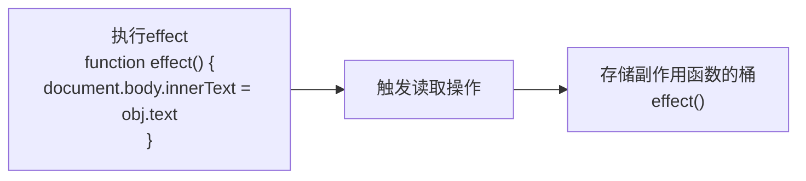
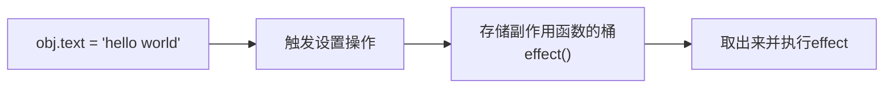

# 响应式系统（1）

因为 vue3 的响应系统算是框架的核心特色，所以这一节不能求快。
而且作者也不打算像上一篇一样概括了，所以篇幅会稍微拉长一点。

这一章需要敲一些代码，只是读帮助不大，甚至看完就忘。
然后基于代码中出现了树形数据结构，因此可以用图表来辅助理解，这样能更清晰的清楚原理。

[示例代码](https://codepen.io/Lin-Alfred/pen/XJJvvjg)

## 从“副作用”开始

**副作用函数指的是在运行中会触发它的作用域以外的行为，比如修改了全局变量、触发了 DOM 操作、打印了日志、触发了网络请求等的函数**。

那么，管理了副作用，可以主动地控制它的执行时机。

```typescript
let globalVar: number = 1

// 副作用函数
function effect() {
    globalVar = 2
}

```

### 那么如何让obj变成响应数据呢？
**响应的本质是什么**，是当数据发生变化时，读取和写入是可被管理和触发的。<br/>
读取：它的副作用函数能够**自动获取最新**的值执行。<br/>
写入：当修改值时，会触发**可跟踪**的设置操作。

当读取这个obj中的text时，将effect函数收集到一个桶里。



当修改obj.text时，会触发**可跟踪**的设置操作，将effect函数从桶中取出并执行。


---

## 实现一个简单的响应系统——Proxy（代理对象，拦截对象访问写入）

首先使用Proxy来拦截对象的读取和写入操作，这是最基础的第一步。

```typescript
// 原始对象
const obj = {
    text: 'hello world'
}
// 用来装副作用的桶
const bucket = new Set<Function>()
// 响应对象
const objProxy = new Proxy(obj, {
    get(target, key) {
        // 添加副作用函数到桶里
        bucket.add(effect)
        return target[key]
    },
    set(target, key, value) {
        target[key] = value
        // 取出副作用函数并执行
        bucket.forEach(fn => fn())
        // 返回true表示设置成功
        return true
    }
})
```

它目前是不灵活的，但基于这个代码上的基础，作者得出了响应系统的工作流程：

1. 读取操作时，将副作用函数收集到桶中。
2. 写入操作时，将桶中的副作用函数取出并执行。

作者将具名的effect函数改为注册机制来管理不同的副作用函数，让它更灵活。以下的`activeEffect`是一个当前激活的副作用函数的代称，也就是说当前执行的具名或匿名的副作用函数会被`activeEffect`代理。

然而，因为不同的副作用函数可能会读取不同的属性，所以需要将副作用函数与属性进行关联。（因为操作对象时可能访问到与副作用不同的属性，导致副作用被额外触发）
**作者在谈及设计怎样的数据结构时，他从代码的视角出发，区分出代码中存在的多个角色（对象）。然后根据对象与对象之间的关系，设计出具体的数据结构。**

```typescript
target 目标对象
  |
  key 属性
    |
    effectFn 副作用函数
```

接下来是用代码实现这个新的桶结构，分别使用到了三种ES2015中的对象:
1. WeakMap：用来存储对象与属性+副作用函数的一对一关系。这里存放是的是“target”与“Map”。
2. Map：用来存储属性与副作用函数之间的一对一关系。这里存放的是“key”与“Set”。
3. Set：用来存储副作用函数。这里存放的是“effectFn”集合。

为什么要使用WeakMap和Map呢？
1. WeakMap的键是弱引用的，不会影响垃圾回收机制。这意味着如果这个响应式对象不被引用，那么它就会被垃圾回收机制回收，而且WeakMap的键必须是对象。那么在使用的时候一个响应式对象不再被引用了，它就理应被回收，而不是累积在内存中导致溢出。
2. Map的键是任意类型的，并且键或值存在一个，该引用则一直存在，会影响垃圾回收机制。

接下来作者对代码做了一段封装处理，将访问属性时的收集操作放到了track函数中，将设置属性时的触发副作用执行的操作放到了trigger函数中。

---

## 完善副作用管理机制

### 分支切换与cleanup

经过之前的处理后，这个响应系统稍微灵活了一点，但遇到分支切换的情形，不被执行的副作用函数依然会被收集到桶中。这样会导致不必要的副作用函数执行。所以，理想情况下，我们希望不被执行的副作用不被收集进入桶中（比如说涉及到DOM更新）。

```typescript
const obj = {
    ok: true,
    text: 'hello world'
}

const obj = new Proxy(obj, {/*...*/})

// 副作用函数收集器
effect(function effectFn() {
    // 分支切换
    document.body.innerText = obj.ok ? obj.text : 'not'
})
```

vue给出的解决方案是，在副作用函数执行前，先将它从桶中删除，然后重新建立依赖关系。
通过重新改写effect函数，在effect内部为副作用函数增加一个`deps`的依赖关系数组，用来存储这个副作用函数的依赖集合。

```typescript
// 被注册的副作用函数
let activeEffect: Function | null = null

// 副作用函数收集器
function effect(fn: Function) {
    const effectFn = () => {
        // 当effectFn执行时，将它设置为当前激活的副作用函数
        activeEffect = effectFn
        fn()
    }
    // activeEffect/effectFn.deps用来存储所有与该副作用函数相关联的依赖集合
    effectFn.deps = []
    // 立即执行副作用函数
    effectFn()
}
```

关键点在于，依赖是如何被收集的，我们将它的收集行为放在track函数中处理。

```javascript
function track(target, key) {
    // 没有激活的副作用函数，直接返回
    if (!activeEffect) return
    let depsMap = bucket.get(target)
    if (!depsMap) {
        bucket.set(target, (depsMap = new Map()))
    }
    // 获取key对应的依赖集合(副作用函数集合 Set)
    let deps = depsMap.get(key)
    if (!deps) {
      depsMap.set(key, (deps = new Set()))
    }
    // 注意:将当前的activeEffect添加到依赖集合中
    deps.add(activeEffect)
    // 然后把deps添加到activeEffect.deps数组中, 这样就可以在activeEffect.deps中找到所有与它相关联的依赖集合
    activeEffect.deps.push(deps)
}
```

看这里其实有点蒙，难以理解作者提到的各种“副作用函数”执行路径，这里我将作者目前提到的一些函数和作用再细说一次：
* effect函数：负责注册管理副作用函数，它的内部新建了一个effectFn函数，副作用函数将在effectFn函数中执行。
* effectFn函数：负责执行副作用函数，它的内部会将自己设置为当前激活的副作用函数。
* activeEffect：当前激活的副作用函数，并且上面挂载了deps属性，用于保存所有依赖的属性。

> 当我们在执行有响应式数据的副作用函数时，首先它会被放到effect函数里，effect函数执行新建了一个effectFn的函数，副作用函数将在该函数中执行。effectFn执行时会被放到activeEffect中，并且effectFn上挂载了依赖集合（结构如`[Set(), Set(), ...]`），然后effectFn被执行，触发了相应的getter或setter。由于目前我们考虑的是getter的情况，所以访问时会执行track函数，track会自动将当前属性关联的副作用函数添加到该属性所对应的依赖集合中。

然后，我们要在effect函数中优先清除effect内部effectFn函数所关联的依赖集合，再在effect中重新执行该副作用函数，触发track并重新建立依赖关系。

也就是说，当我在访问某一个响应式属性时，我才将当前的副作用上下文添加到依赖集合中，并且每次因为函数调用而访问时，都会重新建立依赖关系。

```typescript
// 被注册的副作用函数
let activeEffect: Function | null = null

// 副作用函数收集器
function effect(fn: Function) {
    const effectFn = () => {
        // ***新增这一行：执行前先清除***
        effectFn.cleanup()
        // 当effectFn执行时，将它设置为当前激活的副作用函数
        activeEffect = effectFn
        fn()
    }
    // activeEffect/effectFn.deps用来存储所有与该副作用函数相关联的依赖集合
    effectFn.deps = []
    // 立即执行副作用函数
    effectFn()
}
```

```javascript
function cleanup(effectFn) {
    // 因为deps中存放的是Set的引用，所以这里不能直接删除deps，而是遍历deps中的Set进行删除操作
    for (let i = 0; i < effectFn.deps.length; i++) {
        const deps = effectFn.deps[i]
        // 将当前的effectFn从deps中删除
        deps.delete(effectFn)
    }
    // 最后清空effectFn.deps数组
    effectFn.deps.length = 0
}
```

至此，分支切换的副作用遗留问题已经解决，但因为在遍历时同时新增和删除Set的操作，导致无限调用的问题。
但为了实现依赖合理的收集，上面这样做思路是正确的，所以接下来需要**修正无限调用**的问题。

### 解决无限调用

文中体现出一个重要的解决问题的思路是：把当前看起来复杂的问题抽离出它的基本构造，然后通过分析问题的原理，找到解决思路。

```typescript
const set = new Set(1)

set.forEach((item: number)) => {
    set.delete(1)
    set.add(1)
})
```

将它抽象成基本问题后，再解决就容易多了：

```typescript
const set = new Set(1)

const newSet = new Set(set)

// 这里遍历的是newSet，而不是set
newSet.forEach((item: number)) => {
    // 注意这里是set，而不是newSet
    set.delete(1)
    set.add(1)
})
```
---

## 处理嵌套副作用与执行栈

因为渲染函数是可以嵌套的（组件嵌套），所以我们需要effect可以嵌套执行effectFn。

那么事前做的简单注册机制，决定了effectFn只能执行一次。

```typescript
let activeEffect

function effect(fn) {
    /** ... */
    // 这种写法，意味着嵌套的effectFn会变成activeEffect，而第一层执行的函数内的依赖则不会再被触发。
    activeEffect = fn
    /** ... */
}
```

因此，重点在于activeEffect同一时刻只有一个，所以需要一个容器来注册多个effectFn。

---

## 避免递归和优化执行

### 避免递归

当执行副作用函数时，可能会出现调用自身的情况（文中举例了“自增”操作），为了避免这种情况，作者在trigger中增加了“守卫条件”，“守卫条件”的本质是判断。

### 调度

> 可调度性定义：trigger操作触发副作用函数执行时，有能力决定副作用函数执行的时机、次数和方式。

```typescript
function effect(fn, options = {}) {
    const effectFn = () => {
        cleanup(effectFn)
        activeEffect = effectFn
        fn()
    }
    // 新增options属性，用来存储用户传递的调度对象
    effectFn.options = options
    effectFn.deps = []
    if (!options.lazy) {
        effectFn()
    } else {
        effectFn()
    }
}
```

在trigger中，添加调度逻辑：

```typescript
function trigger(target, key) {
    /**  ... */
    const effectsToRun = new Set()
    effects && effects.forEach(effectFn => {
        // 防止递归调用
        if (effectFn !== activeEffect) {
            effectsToRun.add(effectFn)
        }
    })
    effectsToRun.forEach(effectFn => {
        // 如果一个副作用函数存在调度器，则调用该调度器，并将副作用函数作为参数传递
        if  (effectFn.options.scheduler) {
            effectFn.options.scheduler(effectFn)
        }
        else {
            effectFn()
        }
    })
    /**  ... */
}
```

为什么需要调度？

需要在控制副作用函数的执行行为，比如时机（什么时候执行该函数，执行顺序）、次数（多次执行时是否只更新一次）、方式（同步还是异步）。

基于这个调度器，作者提到了“多次修改响应数据，但只执行一次”的场景。

```typescript
// 任务队列
const jobQueue = new Set()
// 使用Promise.resolve()创建一个promise实例，我们用它将一个任务添加到微任务队列
const p = Promise.resolve()
// 标志代表是否正在刷新队列
let isFlushing = false

function flushJob() {
    // 如果队列正在刷新，则什么都不做
    if (isFlushing) return
    // 当任务队列中有任务时，我们需要将isFlushing设置为true，从而防止重复刷新
    isFlushing = true
    // 在微任务队列中刷新jobQueue队列
    p.then(() => {
        jobQueue.forEach(job => job())
    }).finally(() => {
        // 结束后重置isFlushing
        isFlushing = false
    })
}

// 使用
effect(
    () => {
        state.count++
    },
    {
        // 调度器scheduler是一个函数
        scheduler(fn) {
            // 每次调度时，将副作用函数添加到jobQueue队列中
            jobQueue.add(fn)
            // 调用flushJob函数刷新队列
            flushJob()
        }
    }
)
```

vue为了减少DOM更新，异步更新机制是基于调度思想设计的。