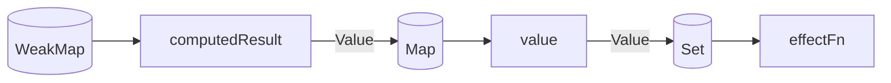

# 响应式系统（2）

[示例代码](https://codepen.io/Lin-Alfred/pen/RNPjWWJ?editors=1011)

## computed

> computed的定义：接受一个 getter 函数，返回一个只读的响应式 ref 对象。该 ref 通过 .value 暴露 getter 函数的返回值。它也可以接受一个带有 get 和 set 函数的对象来创建一个可写的 ref 对象。

在setup的日常使用中，希望一个在需要更新时才计算值，可以使用 computed。如果让我们自己来设计，computed应该是什么样子？

computed方法可以添加 `getter`，用来返回一个值。这个值只有在getter中的值更新时才会更新。

首先上一节我们实现了基础的响应系统，现在可以在调度器中添加 lazy 选项，用以控制computed的执行时机。

基于此我们可以先创建一个computed方法。

```javascript
function computed(getter) {
  // 我们需要触发effect，并将当前的getter作为依赖放进去执行。
  const effectFn = effect(getter, {
    lazy: true, // 但是我们在使用时，并不需要立即执行，而是在值发生变更时进行，所以在options中支持传入一个值，用来控制是否立即执行。
  });
  const computedResult = {
    // 读取值时执行effectFn
    get value() {
      return effectFn();
    },
  };
  return computedResult;
}
```

设计它的关键点在于，传递给effect的函数，会被作为值的副作用函数依赖收集起来。那么这个函数就可以是一个getter。我还没有看到ref的实现，所以暂时先不考虑computed所返回的ref，作者用了`get value`来代指ref。

结合我们之前实现的简易响应系统，让我们调整一下effect。

```javascript
function effect(fn, options = {}) {
  const effectFn = () => {
    cleanup(effectFn);
    activeEffect = effectFn;
    fn();
  };
  effectFn.deps = [];
  effectFn.options = options;
  // lazy为false的话，则立即执行
  if (!options.lazy) {
    effectFn();
  }
  // 注意：返回effectFn，这是抛出的effectFn作为外部手动调用的方法（闭包）。
  return effectFn;
}
```

使用computed

```javascript
const data = { foo: 1, bar: 2 };

const obj = new Proxy(data, { /* ... */ })

const sumFooWithBar = computed(() => obj.foo + obj.bar);

console.log(sumFooWithBar.value); // 3
```

这是最基础的computed实现，接下来就要优化它或解决基础版本带来的问题。

### 缓存与重新计算的时机

**问题**：每次读取effect的值时，都会执行getter。<br/>
**期望**：只有在依赖的值发生变更时，才会重新计算。<br/>
**解决思路**：使用变量来缓存值，并使用变量来控制是否需要重新计算。

```javascript
function computed(getter) {
  let value; // 缓存值
  let dirty = true; // 用来控制是否需要重新计算

  const effectFn = effect(getter, {
    lazy: true,
  })

  const computedResult = {
    get value() {
      if (dirty) {
        value = effectFn();
        dirty = false;
      }
    }
  }

  return computedResult;
}
```

**问题**：现在是解决了访问计算属性时的更新问题，但还有一个问题，参与计算的依赖值更新时（例如foo更新）并不会触发dirty的更新，故而不会重新计算。<br/>
**解决思路**：在computed中的effect使用中，增加调度器，更新依赖的值时，将dirty设置为true，当再次访问该计算属性时，重新计算。

```javascript
function computed(getter) {
  /** ... */
  const effectFn = effect(getter, {
    lazy: true,
    // 添加调度器，当计算依赖被写入值更新时，将dirty设置为true
    scheduler() {
      // 其实scheduler是有一个副作用函数作为参数的，但这里只是更新了dirty，因为getter会被返回给上面的effectFn。
      dirty = true; // 设置dirty为true，但此时还不会自动更新，因为lazy为true，需要手动访问计算属性触发getter，才会更新。
    }
  })
  /** ... */
}
```

### 嵌套读取/更新

**问题**：假设场景一，我们有一个计算属性，它的值是另一个计算属性；假设场景二，我们视图中使用了一个计算属性，而渲染使用了effect来更新。这两种场景都无法触发。
解决思路：

```javascript
/**... */
// 问题描述
// computed：第一个effect
const sumFooWithBar = computed(() => obj.foo + obj.bar);

// 第二个effect
effect(() => {
  // 该方法会立即执行，所以会触发第一次，但不会触发第二次
  console.log(sumFooWithBar.value);
})

obj.foo++;
```

作者这里描述的较为复杂，但简单来说, `obj.foo`和`obj.bar`收集了用户提供的getter，而computed内部返回的 `computedResult.value` 没有作为依赖被收集，所以解决办法是把它加入到响应式系统即可。

```javascript
const computed = (getter) => {
  /**... */
  const effectFn = effect(getter, {
    lazy: true,
    scheduler() {
      dirty = true;
      // 当计算属性依赖的值发生变化(getter被trigger触发执行的是scheduler)时，手动调用trigger函数进行触发
      trigger(computedResult, 'value');
    }
  })

  const computedResult = {
    get value() {
      if (dirty) {
        value = effectFn();
        dirty = false;
      }
      // 当读取value时，手动调用track函数进行追踪
      track(computedResult, 'value');
      return value;
    }
  }
  /**... */
}
```

为了防止看懵，现在我们画一个关系图：



### computed小结

1. computed的本质是一个懒执行的getter函数，当依赖的值发生变化时，会重新执行。
2. 我们通过设置缓存和dirty来控制是否需要重新计算。
3. computed的值更新时，为了让其他引用到它的副作用函数触发更新。computed中的 `computedResult`这个computed函数的内部对象需要被加入到依赖中。

## watch

> watch的定义：侦听一个或多个响应式数据源，并在数据源变化时调用所给的回调函数。

现在我们按照watch的使用来写一个最简单的watch方法。

```javascript
function watch(source, cb) {
  // 通过effect来收集依赖触发source的更新
  effect(() => source.foo, {
    scheduler() {
      // 在这里将调度器看作是一个回调，当source的依赖更新时，会触发scheduler执行，也就是用户提供的cb
      cb();
    }
  }); // 硬编码
}

const data = { foo: 1 };
const obj = new Proxy(data, { /*... */ })

watch(obj, () => {
  console.log('数据源变化了');
})

obj.foo++;
```

有了基本方法，现在开始优化它，首先是硬编码的问题，通过跟踪传入的对象来解决。

### 解决方法内部的对象属性硬编码

```javascript
function watch(source, cb) {
  effect(() => traverse(source), {
    scheduler() {
      cb();
    }
  })
}

// 递归读取对象属性（不包括数组
function traverse(value, seen = new Set()) {
  if (typeof value !== 'object' || value === null || seen.has(value)) {
    return
  }
  seen.add(value);
  for (const key in value) {
    // 收集当前value对象下的所有属性
    traverse(value[key], seen);
  }
  return value;
}
```

> 当直接侦听一个响应式对象时，侦听器会自动启用深层模式

在vue官网上，watch的第一个参数可以是ref对象，也可以是一个getter函数，如果是getter函数，则只有在此函数的返回值更新时触发watch。

```javascript
function watch(source, cb) {
  let getter;
  if (typeof source === 'function') {
    getter = source;
  } else {
    // traverse函数的深度遍历也就是深层模式。
    getter = () => traverse(source);
  }
  /** ... */
}

```

### 监听新值与旧值

这个功能的实现有点像长江前浪推后浪，它的精髓是`lazy`选项和`scheduler`选项。

```javascript
function watch(source, cb) {
  /** ... */
  let oldValue, newValue;
  const effectFn = effect(() => getter, {
    lazy: true,
    scheduler() {
      newValue = effectFn(); // 获取新值
      cb(newValue, oldValue); // 执行回调
      oldValue = newValue; // 回调之后，新值就变成了旧值，也就是“前浪”
    }
  })

  oldValue = effectFn(); // 别忘了手动执行。
}
```

### 立即执行 & 回调执行时机

```javascript
function watch(source, cb, options = {}) {
  /**... */
  // 将 scheduler 单独拿出来做个函数
 // scheduler() {
 //   newValue = effectFn(); // 获取新值
 //   cb(newValue, oldValue); // 执行回调
 //   oldValue = newValue; // 回调之后，新值就变成了旧值，也就是“前浪”
 // }
  const job = () => {
    newValue = effectFn(); // 获取新值
    cb(newValue, oldValue); // 执行回调
    oldValue = newValue; // 回调之后，新值就变成了旧值，也就是“前浪”
  }

  const effectFn = effect(() => getter, {
    lazy: true,
    scheduler: job, // 使用job作为调度器函数
  })

  if (options.immediate) {
    job(); // 立刻执行一次
  } else {
    oldValue = effectFn(); // 别忘了手动执行。
  }
}
```

至于watch的`flush`实现，本质上是调整回调执行时机。是和上一节的微任务队列一样，如果用户在`flush`参数传入了`post`，则使用微任务队列，否则使用宏任务队列。

```javascript
function watch(source, cb, options = {}) {
  /** ... */
  const effectFn = effect(
    () => getter,
    {
      lazy: true,
      scheduler: () => {
        if (options.flush === 'post') {
          const p = Promise.resolve();
          p.then(job);
        } else {
          job();
        }
      }
    }
  )
  /** ... */
}
```

## 过期的副作用（竞态问题）

考虑以下场景：

```javascript
const obj = { foo: 1 };
let fetchData;

watch(
  () => obj,
  async () => {
    fetchData = await fetch('xxx');
  }
)

obj.foo += 1; // 触发watch重的fetch第一次，称之为A操作
obj.foo++; // 触发watch重的fetch第二次，称之为B操作
```

假设B操作触发的fetch返回的数据比A操作快，那么B操作触发fetch返回的数据将会被A操作更慢的操作带来的数据覆盖，这种现象称之为竞态。

所以A虽然是后来返回的，但从顺序上看我们期望的结果是按顺序执行，所以A必须过期，B的异步结果才能生效。

之前的版本使用的是`onInvalidate`来管理过期的副作用，现在(vue3.5)使用`cleanup`来管理过期的副作用。

先看看`onInvalidate`的实现。

```javascript
function watch(source, cb, options = {}) {
  /**... */
  let cleanup;
  const onInvalidate = (fn) => {
    cleanup = fn;
  }

  const job = () => {
    /**... */
    if (cleanup) {
      cleanup(); // 执行过期副作用
    }
    cb(newValue, oldValue, onInvalidate);
    /**... */
  }

  /**... */
}
```

思路：和之前注册副作用函数一样，将过期的副作用注册到watch中，然后在执行用户提供的回调之前，先执行过期的副作用函数。并且将过期的副作用提供给用户。

## 小结

1. computed本质上是一个懒执行的副作用。
2. watch本质上利用了副作用函数重新执行时的可调度性，并且基于此我们也可以控制watch回调的执行时机。
3. watch中的副作用函数，异步部分会过期，为了解决这个问题，vue提供了cleanup方法。