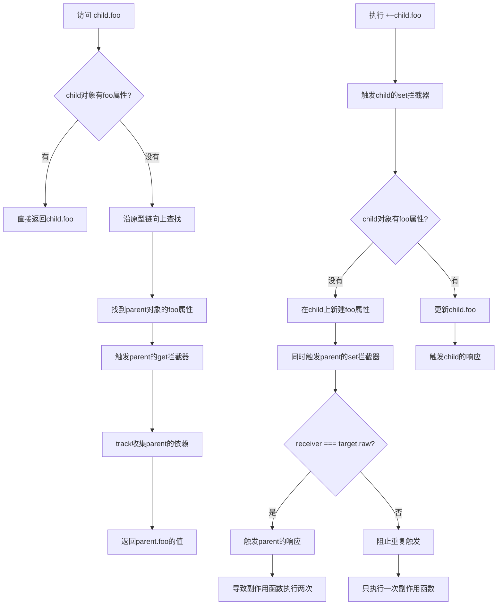

# 非原始值的响应方案（1）

**注意:本章提到了ECMA-262-2021的规范，以下所有的ECMA链接指向的都是该版本的规范。[地址在这里](https://262.ecma-international.org/)**

## Proxy & Reflect

> 代理指的是“对一个对象的基本语义的代理，代理允许拦截并重新定义对一个对象的基本操作。”

Proxy只能代理对象的基本语义。它可以拦截对象的get/set/apply，其中apply是调用方法，而调用对象下的方法则不是基本操作，例如`obj.fn()`，它是两步，读取和调用。想要代理对象，要确保它的读取和写入操作都能被正确拦截/收集。以下是一个例外情况：

```javascript
let obj = {
    foo: 1,
    get bar() { // 访问器属性
        return this.foo;
    }
}

const p = new Proxy(obj, {
    get(target, key, receiver) {
        return target[key];
    },
    set(target, key, value, receiver) {
        target[key] = value;
        trigger(target, key);
    }
})

effect(() => {
    console.log(p.foo, p.bar); // 1 1
})

p.foo = 2;

console.log(p.foo, p.bar); // 2 1
```

可以看到修改了`p.foo`，但是`p.bar`的值没有改变，这是因为`this`指向的是`target`,而`target`在Proxy中指向的是原对象`obj`而不是`p`。

---

## 对象

> Javascript中的一切都是对象。

在javascript的ES规范中，JS的对象分为两种：
1. 普通对象（Ordinary Object）[ECMA规范地址](https://262.ecma-international.org/12.0/index.html?_gl=1*1pwl27x*_ga*MTM0MDAyMDA1NS4xNzQ5MDUzNTc1*_ga_TDCK4DWEPP*czE3NDkwNTM1NzQkbzEkZzAkdDE3NDkwNTM1NzQkajYwJGwwJGgw#sec-ordinary-object)
2. 异质对象（Exotic Object）[ECMA规范地址](https://262.ecma-international.org/12.0/index.html?_gl=1*1pwl27x*_ga*MTM0MDAyMDA1NS4xNzQ5MDUzNTc1*_ga_TDCK4DWEPP*czE3NDkwNTM1NzQkbzEkZzAkdDE3NDkwNTM1NzQkajYwJGwwJGgw#sec-exotic-object)
3. 界定普通对象和异质对象的行为：[ECMA规范地址](https://262.ecma-international.org/12.0/index.html?_gl=1*1pwl27x*_ga*MTM0MDAyMDA1NS4xNzQ5MDUzNTc1*_ga_TDCK4DWEPP*czE3NDkwNTM1NzQkbzEkZzAkdDE3NDkwNTM1NzQkajYwJGwwJGgw#sec-ordinary-and-exotic-objects-behaviours)

### ECMA 规范中的术语及表达

#### 抽象操作（Abstract Operations）
抽象操作是ECMAScript规范中定义的一些基础算法操作，用于描述语言的基本行为。它们不是JavaScript语言本身的一部分，而是用来定义语言语义的工具。

例如：
- Get(O, P) - 用于描述对象属性读取的基本逻辑
- Set(O, P, V) - 用于描述对象属性设置的基本逻辑
- HasProperty(O, P) - 用于检查对象是否具有特定属性

在规范中，使用 ? 前缀表示该操作可能会抛出异常，需要进行异常传播处理（如 ? Get(obj, "key")）。
<br/><br/>

#### 内部槽（Internal Slots）
内部槽是ECMAScript引擎内部使用的数据结构，用于存储对象的内部状态和元数据信息。它们使用双方括号标记（如[[Prototype]]），在JavaScript代码中无法直接访问。

主要特点：
- 用于存储对象的内部状态
- 只能被内部方法和规范算法访问
- 在具体实现中可能以不同方式实现

以Proxy对象为例，其核心内部槽包括：
- [[ProxyHandler]] - 存储处理器对象
- [[ProxyTarget]] - 存储目标对象
<br/><br/>

#### 内部方法（Internal Methods）
内部方法是ECMAScript规范定义的一组标准行为，用于规范对象在执行各种基本操作时的具体行为。它们构成了JavaScript对象行为的基础。

主要特征：
- 使用双方括号表示（如[[Get]]、[[Set]]）
- 定义对象的基本操作语义
- 可以被具体实现定制（尤其是在异质对象中）

常见的内部方法包括：
- [[Get]] - 属性读取
- [[Set]] - 属性写入
- [[Delete]] - 属性删除
- [[HasProperty]] - 属性存在性检查
<br/><br/>

#### 规范类型（Specification Types）
规范类型是ECMAScript规范中用于描述语言行为的抽象数据类型。它们只存在于规范层面，用于精确定义语言的语义，而不会在实际的JavaScript代码中直接暴露。

主要用途：
- 描述语言操作的中间状态和结果
- 定义算法的输入和输出
- 规范化语言行为的表达

常见的规范类型包括：
- Reference - 用于处理变量和属性引用
- Completion Record - 用于表示语句执行的完成状态
- Property Descriptor - 用于描述对象属性的特性

---

## 正确地触发响应（如何代理 Object）

### 拦截读取/删除操作

#### 访问属性 `obj.foo`

实现关键点：Proxy对被代理对象 `[[Get]]` 内部槽的拦截方法：`get`

#### 判断对象或原型上是否有给定的key：key in obj

实现关键点：<br/>
ECMA-262 规范 13.10.1 节的
> 返回 ? HasProperty(rval, ? ToPropertyKey(lval))。<br/>
> 得知 in 运算符的操作结果是通过 HasProperty 得到的。

ECMA-262 规范的 7.3.11 节的
> 返回 ? O.[[HasProperty]] (P)。<br/>
> 得知 HasProperty 的方法返回值是通过对象内部 [[HasProperty]] 获取的。

所以可以通过`Reflect.has(target, key)`来判断对象或原型上是否有给定的key。

```javascript
const obj = { foo: 1 }
const p = new Proxy(obj, {
    has(target, key) {
        track(target, key)
        return Reflect.has(target, key)
    }
})
```

#### 使用for...in 循环对象：for (let key in obj) {}

首先弄清楚`for...in`依赖于哪些基础语义方法。（14.7.5.6/.6.c

实现关键点：<br/>
> EnumerateObjectProperties(obj)，obj是被`for...in`的目标对象，返回一个迭代器<br>

```javascript
function* EnumerateObjectProperties(obj) {
    const visited = new Set()
    // 关键点 Reflect.ownKeys
    for (const key of Reflect.ownKeys(obj)) {
        if (typeof key === 'symbol') continue
        const desc = Reflect.getOwnPropertyDescriptor(obj, key)
        if (desc) {
            visited.add(key)
            if (desc.enumerable) yield key
        }
    }
    const proto = Reflect.getPrototypeOf(obj)
    if (proto === null) return
    for (const protoKey of EnumerateObjectProperties(proto)) {
        if (!visited.has(protoKey)) yield protoKey
    }
}
```

接着

```javascript
const obj = { foo: 1 }
const ITERATE_KEY = Symbol()

const p = new Proxy(obj, {
    ownKeys(target) {
        // 因为ownKeys是用来获取对象内部所有键值的，没有单个key，所以需要提供一个 ITERATE_KEY ，将副作用函数与 ITERATE_KEY 关联
        track(target, ITERATE_KEY)
        return Reflect.ownKeys(target)
    }
})
```

但 ITERATE_KEY 指代的是`for...in`循环的目标对象，而不是目标对象里的某个具体的属性，所以在读写目标对象的属性时，并不能触发 ITERATE_KEY 绑定的副作用函数。现在在`set`中的`trigger`方法添加对 ITERATE_KEY 的处理。

```javascript
function trigger(target, key) {
    const depsMap = bucket.get(target)
    if (!depsMap) return
    // 取得与 key 关联的副作用函数
    const effects = depsMap.get(key)
    // 取得与 ITERATE_KEY 关联的副作用函数
    const iterateEffects = depsMap.get(ITERATE_KEY)

    const effectsToRun = new Set()
    effects && effects.forEach(fn => {
        if (effectFn !== activeEffect) {
            effectsToRun.add(fn)
        }
    })
    iterateEffects && iterateEffects.forEach(fn => {
        if (effectFn !== activeEffect) {
            effectsToRun.add(fn)
        }
    })
    /** 其他逻辑... */

    effectsToRun.forEach(fn => {
        if (effectFn.options.scheduler) {
            effectFn.options.scheduler(fn)
        } else {
            effectFn()
        }
    })
}
```

for中使用 ownKeys 的目的是需要拿到对象的所有键，当设置新值时，for循环所涉及的键数量会发生变化。但如果是更新值的话，对for循环不会有任何影响。

问题的根本在于，设置新属性和更新属性都会在`set`拦截内被触发，也就是说现在更新目标对象的属性时整个`for...in`循环的副作用函数会被重新执行一遍，性能会有一定损耗。那么解决办法是可以在`set`拦截设置新属性和更新属性的两种行为，这样可以分别管理行为。这里使用了`Object.prototype.hasOwnProperty`来检查当前操作的属性是否是目标对象上已有的属性。

```javascript
/** ... */
set(target, key, value, receiver) {
    const type = Object.prototype.hasOwnProperty.call(target, key) ? 'SET' : 'ADD';

    // 将 type 添加到参数中
    trigger(target, key, type);
}
/** ... */
```

随后在trigger中，只有当操作类型为“ADD”时，才触发 `ITERATE_KEY` 相关的副作用函数重新执行。

#### delete 操作

实现关键点：<br/>
ECMA-262 规范 13.5.1.2 节的
> 让 deleteStatus 的值为 ? baseObj.\[\[Delete\]\](ref.[[ReferencedName]])。<br/>
> 这意味着delete操作符依赖于 Delete 的内部方法 deleteProperty。

```javascript
const p = new Proxy(obj, {
    deleteProperty(target, key) {
        // 检查操作的属性是否是对象自己的
        const hadKey = Object.prototype.hasOwnProperty.call(target, key);
        // 使用 Reflect.deleteProperty 删除属性
        const result = Reflect.deleteProperty(target, key);

        if (hadKey && result) {
            // 只有属性属于目标对象 且 删除成功 才触发副作用函数，类型为 DELETE
            trigger(target, key, 'DELETE');
        }

        return result;
    }
})
```

因为删除属性时会导致目标对象的属性变少，所以在 `trigger` 中判断type为 `DELETE` 时，触发`ITERATE_KEY` 相关的副作用函数重新执行。

---

## 合理地触发响应

### 问题1（设置值，但值没有改变理应不触发）

```javascript
const obj = { foo: 1 }

const p = new Proxy(obj, { /* ... */ })

effect(() => {
    console.log(p.foo)
})

obj.foo = 1
```

如果 foo 属性值没有改变，继续触发响应合理吗？<br/>
在`set`执行`trigger`之前，做一层判断，判断新旧值不全等，并且都不是NaN，才触发响应。

但是单论属性值的全等还不够。

作者在此处引入了`reactive`函数来说明，它接收一个对象，会返回一个响应的对象。

```javascript
function reactive(obj) {
    return new Proxy(obj, { /* ... */ })
}

const obj = {}
const proto = { foo: 1 }
const child = reactive(obj)
const parent = reactive(proto)
Object.setPrototypeOf(child, parent)

effect(() => {
    console.log(child.foo) // 会导致执行两次
})

++child.foo // 2
```



如上所示，如果创建的响应对象中没有受到访问的属性，则会向原型链的上一层查找，并调用了原型对象上的\[\[Set\]\]内部方法，因为原型对象本身也是响应数据，所以它的副作用函数又会被触发一次。

**下一个设计点：我们要如何在set操作时区分这两种情况？**

1、首先我们需要拦截child触发parent的set副作用<br/>
2、其次我们需要允许它访问parent的属性<br/>
3、我们发现parent代理的set被child的set触发时，set参数中`target`是原始对象`proto`，而`receiver`是代理对象`child`。<br/>
4、而代理对象可以通过`raw`访问原始对象，那么我们可以在set拦截函数中判断`receiver`是不是`target`的代理对象。

```javascript
function reactive(obj) {
    return new Proxy(obj, {
        set(target, key, value, receiver) {
            const oldValue = target[key];
            const type = Object.prototype.hasOwnProperty.call(target, key) ? 'SET' : 'ADD';
            const result = Reflect.set(target, key, value, receiver);

            // 判断receiver是不是target的代理对象,如果是,说明是在设置代理对象的属性,否则是在设置原始对象的属性
            if (target === receiver.raw) {
                if (oldValue !== value && (oldValue === oldValue || value === value)) {
                    trigger(target, key, type);
                }
            }
            return result;
        }
    })
}
```

## 小结

1. 代理是对一个对象基本语义的代理，代理允许拦截并重定义对一个对象的基本操作；
2. 界定 Ordinary Object 和 Exotic Object：
   1. Ordinary：遵循ES标准定义的对的内部槽/内部方法，没有额外约束或特殊处理；
   2. Exotic：实现了“非标准”或“定制化”的内部方法行为，它的属性访问、对象拓展、参数映射、原型链等可能被重写或特殊处理；
3. 内部方法有多态性，利用内部槽和内部方法的实现区分普通对象和函数或其他对象；
4. 我们通过操作普通对象的几种方式（`obj.key`、`for...in`、`key in obj`、`delete`），对普通对象进行了代理拦截，从而实现对普通对象的代理控制；
5. 我们细化了代理时对对象的操作类型，并且通过`receiver.raw`对代理对象的prototype链进行了处理，使其不会在原型链上触发副作用；